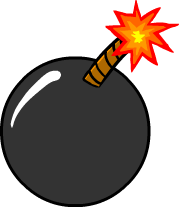

# Whack a Mole 🦦

**Welcome to Whack a Mole. In this fast-paced web game players click on randomly appearing moles on a 3x3 grid to test their reflexes. You get a timer set at 30 seconds, the objective is to score as many points as you can. You get points when you click on moles, but watch out, because clicking on a bomb immediately ends the game!**

## Features of the game 
- ***Random mole and bomb appearances***
- ***A scoring system with win/loss messages***

- ***A reset button to restart the game anytime***
- ***A countdown progress bar***

``Tip: For extra points, double click the Mole as soon as he appears in the Hole, but be careful because sometimes the same Hole get's replaced with a bomb``

## Attributions and Technologies

- [Sprites/images](<../../../../OneDrive/Desktop/Whack A Mole>) 

- ``javascript, index.html, style.css, readme.md``

## Planned future enhancement
- **Adding a difficulty to the game (such as making the mole faster and more bombs being in the tiles)**

- **Time boost or freeze power-ups**
- **Animated Mole(eg, popping up/down,exploding bomb)**
- **adding sound effects to the game**
- **High score Tracking**